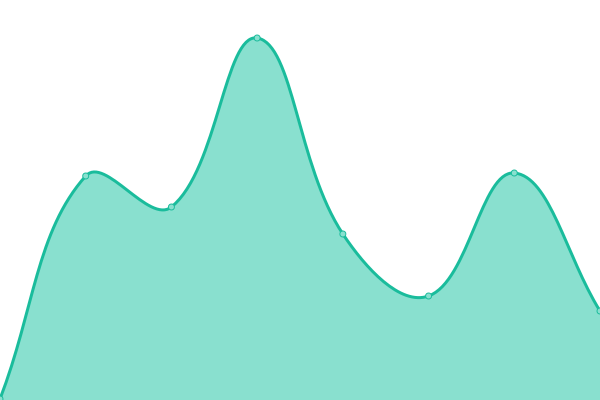

# [📈 Live Status](https://demo.upptime.js.org): <!--live status--> **🟩 All systems operational**

This repository contains the open-source uptime monitor and status page for [Upptime](https://upptime.js.org), powered by [Upptime](https://github.com/upptime/upptime).

With [Upptime](https://upptime.js.org), you can get your own unlimited and free uptime monitor and status page, powered entirely by a GitHub repository. We use [Issues](https://github.com/upptime/upptime/issues) as incident reports, [Actions](https://github.com/LloydGain/upptime/actions) as uptime monitors, and [Pages](https://demo.upptime.js.org) for the status page.

<!--start: status pages-->
<!-- This summary is generated by Upptime (https://github.com/upptime/upptime) -->
<!-- Do not edit this manually, your changes will be overwritten -->
<!-- prettier-ignore -->
| URL | Status | History | Response Time | Uptime |
| --- | ------ | ------- | ------------- | ------ |
|  [DQ](https://dq.yam.com/) | 🟩 Up | [dq.yml](https://github.com/LloydGain/UppTIME/commits/HEAD/history/dq.yml) | 

 1263ms
     
 | 

<a href="https://demo.upptime.js.org/history/dq">100.00%</a>
    

|  [bookroll](https://brpt.bookroll.org.tw/login/index.php) | 🟩 Up | [bookroll.yml](https://github.com/LloydGain/UppTIME/commits/HEAD/history/bookroll.yml) | 

 1541ms
     
 | 

<a href="https://demo.upptime.js.org/history/bookroll">100.00%</a>
    

|  [geeks for geeks](https://www.geeksforgeeks.org/) | 🟩 Up | [geeks-for-geeks.yml](https://github.com/LloydGain/UppTIME/commits/HEAD/history/geeks-for-geeks.yml) | 

 125ms
     
 | 

<a href="https://demo.upptime.js.org/history/geeks-for-geeks">100.00%</a>
    

|  [Lloyd github page](https://lloydgain.github.io/) | 🟩 Up | [lloyd-github-page.yml](https://github.com/LloydGain/UppTIME/commits/HEAD/history/lloyd-github-page.yml) | 

 248ms
     
 | 

<a href="https://demo.upptime.js.org/history/lloyd-github-page">100.00%</a>
    

<!--end: status pages-->

[**Visit our status website →**](https://demo.upptime.js.org)

## 📄 License

- Powered by: [Upptime](https://github.com/upptime/upptime)
- Code: [MIT](./LICENSE) © [Upptime](https://upptime.js.org)
- Data in the `./history` directory: [Open Database License](https://opendatacommons.org/licenses/odbl/1-0/)
